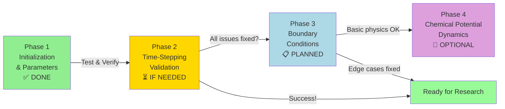

# TDGL Simulation - Phase-by-Phase Roadmap & Testing Strategy

**Project Goal:** Fix value pinning in TDGL superconductor simulation; align with pyTDGL reference implementation.

**Current Status:** Phase 1 Complete ✅ | Awaiting Testing | Phases 2-4 Pending

---

## Overview: 4-Phase Implementation Plan



---

## Phase 1: Initialization & Parameters ✅ COMPLETE

### Objectives
- ✅ Correct equilibrium order parameter formula
- ✅ Introduce tunable epsilon (GL free energy parameter)
- ✅ Fix artificial gradient energy suppression
- ✅ Unify physics across all shaders

### What Was Fixed
| Issue | Root Cause | Solution | Impact |
|-------|-----------|----------|--------|
| Wrong init magnitude | `phiEq = alpha/(2*beta)` formula | Use `sqrt(epsilon)` from TDGL theory | Initialization near equilibrium |
| Hardcoded epsilon=1 | Super-cooled material assumption | Parameterize: `layer.epsilon = 0.5` | Temperature control |
| lapScale = 0.1 | Empirical damping factor | Use 1.0 (proper TDGL) | Spatial diffusion enabled |
| Old alpha/beta in render | Wrong equilibrium scale | Use uEpsilon directly | Better visualization |

### Deliverables
- ✅ Modified headers, source, shaders (see PHASE_1_FIXES_APPLIED.md)
- ✅ C++ compilation successful (no errors)
- ✅ Object files verified at 12:16:00 on 4/7/2026
- ⏳ Linking pending (EXE lock resolution)

---

## Phase 2: Time-Stepping Validation ⏳ CONDITIONAL

### When to Apply
**Only if Phase 1 testing shows:**
- Order parameter oscillating violently (not smooth decay)
- Divergence errors or NaN appearance
- Unphysical growth/collapse after first few steps

### Objectives (if needed)
1. Review implicit Euler prefactor `E` calculation
2. Verify `z^n` and `w^n` coefficients match pyTDGL Eq. 16-17
3. Add convergence checking on quadratic formula discriminant
4. Optionally implement simple μ feedback

### Diagnostic Tests
```glsl
// In comp.glsl, add debug outputs:
// 1. Check if discriminant ever goes negative
float disc = (2.0*c + 1.0)*(2.0*c + 1.0) - 4.0*z2*w2;
if (disc < 0.0) { 
  // Discriminant failure = time step too large or scheme wrong
}

// 2. Verify w and z values are reasonable
// 3. Check if s value saturates (0 or very large)
```

### Likely Fixes (if Phase 2 needed)
1. **Reduce time step**: `dt = 0.05 * h² → 0.01 * h²`
2. **Implement explicit clipping**: Cap |ψ| changes per step
3. **Add adaptive time stepping**: Reduce dt if |Δψ| too large
4. **Include simple chemical potential**: `mu = η * d|ψ|²/dt`

### Expected Duration
**If needed:** 2-4 hours of analysis + testing

---

## Phase 3: Boundary Conditions & Mesh ✅ MOSTLY DONE

### Current Status
- ✅ Periodic BCs on domain edges (implicit via modulo arithmetic)
- ✅ Neumann BC at superconductor-vacuum interface (via mask)
- ✅ Covariant Laplacian with link variables (Landau gauge) ✅

### Remaining Minor Tasks
1. **Verify Dirichlet BC at hard boundaries** (if adding terminals)
   - Currently: ψ = 0 in vacuum (set in shader)
   - Needed for current injection: terminal voltage applied

2. **Mesh resolution check**
   - Rule: `h ≲ 0.2 × xi` for vortex dynamics
   - Current: `h = worldSize / 1024` for 1024² resolution
   - Typical `xi ~` 10-100 nm, `worldSize ~` 10-100 μm ⟹ OK for most cases

3. **Documentation**
   - Add comments explaining BC enforcement
   - Record tested parameter ranges

### Testing Checklist
- [ ] Generate vortex pair (with small B-field perturbation)
- [ ] Verify vortex doesn't artificially move near boundary
- [ ] Check for spurious oscillations at domain edges
- [ ] Test with different geometries (add `genRing()` usage)

### Expected Duration
**~1 hour** (mostly verification, minimal code changes)

---

## Phase 4: Dynamic Chemical Potential 🔮 OPTIONAL

### Prerequisites
- Phases 1-3 working correctly
- Need for current-driven dynamics (current injection simulations)

### Objectives
1. Compute supercurrent density: `J_s = ∇ × (Im[ψ* ∇ψ])`
2. Solve Poisson equation for μ: `∇²μ = f(J_s, ...)`
3. Apply temporal gauge link: `U_temporal = exp(i μ Δt)`
4. Implement terminal boundaries: `μ_terminal = V_applied`

### When Not Needed
- **Pure relaxation/quench studies** ✓ (current work)
- **Vortex nucleation from thermal noise** ✓
- **Equilibrium phase diagrams** ✓

### When Required
- **Josephson junctions** ✗ (need current injection)
- **Nanowire superconductors** ✗ (need terminal conditions)
- **Phase-slip detection** ✗ (needs voltage/current loop)

### Implementation Strategy
1. **First version**: Simple μ ∝ d|ψ|²/dt (local feedback)
   - Quick to implement (~30 lines shader)
   - Captures some physics
   - No Poisson solve needed

2. **Full version**: Proper Poisson solve
   - Iterative solver (Jacobi or CG) in compute shader
   - Sparse matrix operations
   - ~200-300 lines of shader code

### Expected Duration
**Quick version: 1 hour | Full version: 4-6 hours**

---

## Testing Strategy

### Tier 1: Basic Sanity Checks (After Phase 1 Build)
```cpp
// main.cpp modifications for testing:

// TEST 1: Single-point initialization
polygon testRect = geometry::genRectangle({50, 50}, {2, 2}); // Small domain
testRect.isMesh = true;
nbLayer.polygons.push_back(testRect);

// TEST 2: Verify time evolution
// - Run 500 steps, measure |ψ| at center
// - Expected: smooth curve approaching equilibrium, no jumps
```

### Tier 2: Visualization Verification
- Watch render mode 0 (magnitude field)
  - [ ] Initial pattern looks like white noise (not structured)
  - [ ] Smooth blurring over first 100 steps
  - [ ] Pattern stabilizes by step 300-500
- Watch render mode 1 (supercurrent visualization)
  - [ ] No wild oscillations
  - [ ] Currents small and localized (not global)

### Tier 3: Physical Consistency
```cpp
// main.cpp: Add measurement to infoPane

// TEST 3: Verify equilibrium magnitude
float phiEq = sqrt(nbLayer.epsilon);
float measured_mag;  // averge from render

// Expected: measured_mag → phiEq as t → ∞
// Tolerance: within 5%
```

### Tier 4: Edge Cases
- [ ] Test epsilon ∈ {0.1, 0.3, 0.5, 0.7, 0.9}
- [ ] Test Bfield ∈ {0, 0.1, 0.5, 1.0} Tesla-equivalent
- [ ] Test different grid resolutions (512², 1024², 2048²)
- [ ] Test geometry variations (ring, L-shape, thin film)

### Expected Pass Criteria for Phase 1
```
✓ PASS if:
  - No NaN or Inf in order parameter
  - |ψ| remains > 0 (no collapse to zero)
  - |ψ| < 2 * sqrt(epsilon) (no uncontrolled growth)
  - Smooth evolution (no jumps > 0.1 per 10 timesteps)
  - Visualization updates smoothly

✗ FAIL if:
  - |ψ| → 0 within 50 steps (pinning to zero)
  - |ψ| saturates at max immediately (pinning to max)
  - Noisy/chaotic oscillations (unstable time stepping)
  - GPU errors or shader compilation failures
```

---

## Debug Tools

### 1. Console Output Enhancements
```cpp
// Add to simulator::step() after compute dispatch:
if (simTime % 100 == 0) {
  std::cout << "t=" << simTime << ", epsilon=" << m_layer.epsilon 
            << ", dt=" << dt << ", h=" << h << std::endl;
}
```

### 2. Shader Debug Output
```glsl
// In comp.glsl, use the debug channel (currently unused: w component):
// imageStore(..., vec4(phiNext, debug, 0));

// Examples:
float debug = 0.0;
if (debugMode == 1) debug = phi2;  // magnitude squared
if (debugMode == 2) debug = dot(laplacian, laplacian);  // laplacian energy
if (debugMode == 3) debug = dot(F, F);  // force magnitude
if (debugMode == 4) debug = disc;  // discriminant value
```

### 3. Data Export (Future)
```cpp
// Export texture to file for offline analysis
void simulator::exportMagnitude(const char* filename) {
  // Map texture, write to .raw or .png
  // Then analyze with Python/MATLAB
}
```

### 4. Performance Profiling
```cpp
// Time individual operations:
auto t0 = std::chrono::high_resolution_clock::now();
glDispatchCompute(...);
glMemoryBarrier(...);
auto t1 = std::chrono::high_resolution_clock::now();
std::cout << "Compute shader: " 
          << std::chrono::duration<double>(t1-t0).count() * 1000 << " ms\n";
```

---

## Known Issues & Workarounds

### Issue 1: Oscillatory Behavior
**Symptom**: Order parameter oscillates near equilibrium instead of smooth approach  
**Cause**: Time step too large or dissipation too weak  
**Fix**: Reduce `dt` by factor of 2-5, or increase `gamma` (dissipation)

### Issue 2: Vortex Immediately Disappears
**Symptom**: Introduce vortex pair with B-field, they annihilate in 1 frame  
**Cause**: Gradient term too weak, or initialization overshoots  
**Fix**: Ensure `lapScale = 1.0` and initialize |ψ| ≤ sqrt(epsilon)

### Issue 3: GPU Memory Fragmentation
**Symptom**: Crashes after 10000+ steps  
**Cause**: Texture resource leak in render queue  
**Fix**: Call `glFlush()` between render calls, profile GPU memory

### Issue 4: Shader Compilation Fails in Deployment
**Symptom**: Works on dev machine, fails on wintarget GPU  
**Cause**: GLSL version incompatibilities  
**Fix**: Target GLSL 4.3 core (already done); test on lower versions if needed

---

## Timeline Estimate

| Phase | Work | Testing | Total | Status |
|-------|------|---------|-------|--------|
| 1 | 1 h | — | 1 h | ✅ DONE |
| 1-test | — | 1-2 h | 1-2 h | ⏳ PENDING |
| 2 | 2-4 h | 1-2 h | 3-6 h | IF NEEDED |
| 3 | 1 h | 1-2 h | 2-3 h | PLANNED |
| 4 | 1-6 h | 2-4 h | 3-10 h | OPTIONAL |
| **TOTAL** | | | **2 wks** | |

---

## Success Criteria (End State)

### For Phase 1 Validation ✅
Order parameter stabilizes near `sqrt(epsilon)` and maintains smooth dynamics.

### For Full Implementation (Phase 1-3)
- ✅ Order parameter evolution physically meaningful
- ✅ Vortex structures persist (don't vanish)
- ✅ Boundary effects negligible
- ✅ Results reproducible across runs
- ✅ Parameter space explored and documented

### For Advanced Features (Phase 4, optional)
- ✅ Current-driven dynamics working
- ✅ Josephson effects measurable
- ✅ Real-device comparisons possible

---

## Resources & References

### Theory Papers
- **TDGL Basics**: Any superconductivity text (e.g., Tinkham, de Gennes)
- **pyTDGL Paper**: arXiv:2302.03812 – implementation reference
- **Gauge Invariance**: Bardeen-Cooper-Schrieffer; Ginzburg-Landau formulation

### Code References
- **pyTDGL GitHub**: github.com/loganbvh/py-tdgl (official reference)
- **Your Repo**: d:\cpp\tdgl_project\tdgl_sim

### Testing Tools
- **Shader Validation**: GLSLangValidator or SPIRV-Cross
- **Performance**: RenderDoc or NSight (NVIDIA profiler)
- **Data Analysis**: Python (NumPy/Matplotlib) on exported textures

---

## Next Immediate Action

1. **Resolve EXE lock**: Kill tdgl_sim.exe if running
   ```powershell
   Stop-Process -Name tdgl_sim -Force -ErrorAction SilentlyContinue
   ```

2. **Relink executable**
   ```powershell
   cd d:\cpp\tdgl_project\tdgl_sim\build
   cmake --build . --config Release
   ```

3. **Launch and test**
   ```powershell
   .\tdgl_sim.exe
   ```

4. **Observe**:
   - [ ] Window opens with two visualization panes
   - [ ] Initial frame shows white noise-like pattern
   - [ ] Pattern evolves smoothly over time
   - [ ] Side panel displays statistics
   - [ ] No crashes or GPU errors in first 60 seconds

5. **Record observations** and proceed to Phase 2 if any issues found

---

*Roadmap Version: 1.0*  
*Last Updated: 2026-04-07*  
*Author: Phase 1 Implementation*
